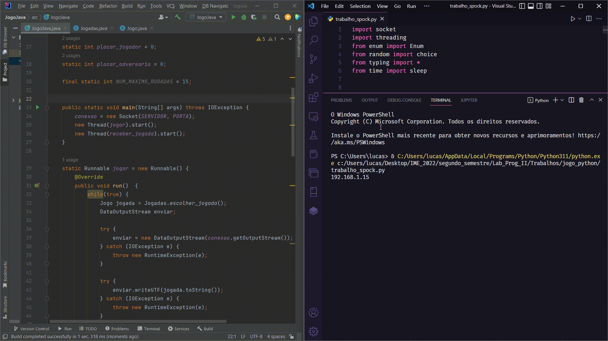

# Jokenpo
O trabalho consiste numa competição entre Python e Java em um jogo de Jokempo Online. 
<h1 align="center">
  
</h1>
Nesse trabalho, o programa Python serve como um servidor e o programa Java serve como um cliente. A cada momento, mensagens são trocadas entre ambos a fim de que cada um saiba a jogada do outro. 
